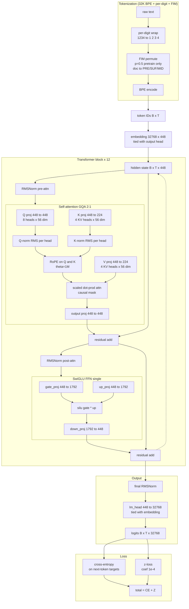

# Crowfeather-50M-v1

[](https://colab.research.google.com/github/Crownelius/crowfeather-50m-v1/blob/main/notebooks/crowfeather_50m_v1.ipynb)
[](LICENSE)

A 50.8M-parameter dense Qwen3 language model trained on consumer-grade hardware. Custom 32K Byte-Level BPE tokenizer with per-digit number wrap and Fill-in-the-Middle (FIM) support. Distillation-pretrained on traces from DeepSeek R1, Anthropic Sonnet 4.6, NuminaMath-CoT, MetaMathQA, and Anthropic Opus 4.6. Released under Apache 2.0.

This repo is a direct upgrade of [`CompactAI-O/Shard-40m-v1`](https://huggingface.co/CompactAI-O/Shard-40m-v1) (54.5M dense, 8K BPE, MHA, no distillation): every architectural lever is the next sensible step from that baseline.

## Open in Colab → run all → done

Click the badge above. Inside Colab:
1. **Runtime → Change runtime type → A100 GPU** (80GB recommended; 40GB supported)
2. **Set Colab Secrets** (key icon in left sidebar): `HF_TOKEN` and `WANDB_API_KEY`
3. **Runtime → Run all** (Ctrl+F9). The notebook is fully resumable; if Colab disconnects, just re-run from the top.

Total ~11-13h on A100 80GB at ~$15-20 PAYG (1-2 Colab Pro sessions).

### Before the full run: verify your GPU envelope (~5 min)

If you're on an A100 40GB, run the [limit-test notebook](https://colab.research.google.com/github/Crownelius/crowfeather-50m-v1/blob/main/notebooks/a100_40gb_limit_test.ipynb) first. It uses synthetic data (no precache, no BPE training) to confirm Phase 1/2/3 each fit at the 40GB-adjusted batch sizes, and projects wall time + cost from measured throughput. PASS = green light to launch the main notebook.

---

## Status

Pre-launch. Training begins after this commit lands.

| Stage | Status |
|---|---|
| Architecture spec | locked |
| Training recipe | locked |
| Notebook | shipped |
| Phase 0 BPE training | not started |
| Phase 1 pretrain (FIM 0.5) | not started |
| Phase 2 CPT @ 16K | not started |
| Phase 3 SFT @ 4K | not started |
| HF release | not started |

---

## What's new vs Shard-40m-v1

| Lever | Shard-40m-v1 | Crowfeather-50M-v1 | Why |
|---|---|---|---|
| Pretrain corpus | raw web text | 100% distillation (R1 + Sonnet + NuminaMath + MetaMathQA + Opus) | sample efficiency |
| Tokenizer vocab | 8K | 32K | 4x more single-token words |
| Tokenizer special tokens | basic | + FIM (3) + chat roles + think tags | infill capability |
| Number handling | none | per-digit wrap | math arithmetic |
| Attention | MHA | GQA 2:1 (8 Q heads / 4 KV heads) | 50% smaller KV cache |
| Optimizer | AdamW | Muon V4 (hidden 2D) + AdamW (embed/norm) | better singular value control |
| LR schedule | cosine | WSD with sqrt cooldown | 1.56x integrated LR |
| Beta2 | static 0.95 | ramp 0.95 -> 0.97 | late-stage stability |
| Loss | CE | CE + z-loss (1e-4) | logit norm control |
| Memory | stock | Liger Kernel fused CE | headroom for longer context |
| Context max | 2K | 16K (4K pretrain -> 16K CPT) | longer effective context |
| FIM | no | yes (50% during pretrain) | infill at inference for free |

Same compute envelope, much more capability per parameter.

---

## Architecture flowchart



Note: no MoE router, no aux loss. The Crowfeather-412M-3E sibling architecture has those — see [docs/future/CROWFEATHER-412M-3E.md](docs/future/CROWFEATHER-412M-3E.md).

---

## Specifications

### Model shape

| Component | Value |
|---|---|
| Architecture | Qwen3 (HF transformers, dense) |
| Total parameters | ~50.8M (dense — stored = active) |
| Hidden dimension | 448 |
| Layers | 12 |
| Attention heads (Q) | 8 |
| Attention heads (KV, GQA 2:1) | 4 |
| Head dimension | 56 |
| Q-norm / K-norm | RMS per head (Qwen3 native) |
| FFN intermediate | 1792 (~4x hidden, SwiGLU 3-matrix) |
| Vocabulary size | 32,768 (custom Byte-Level BPE) |
| Maximum context length | 16,384 (16K) |
| RoPE base | 1,000,000 |
| Activation | SiLU (SwiGLU gate) |
| Norm | RMSNorm, pre-norm |
| Embeddings | tied input / output |
| Tokenizer | custom 32K BPE + per-digit input wrap + 18 special tokens |

### Tokenizer

Custom Byte-Level BPE trained on the distillation corpus during Phase 0:
- Vocab: 32,768 (256 byte alphabet + 18 special + ~32,494 BPE merges)
- Per-digit wrap applied to corpus before training (no multi-digit number tokens)
- Byte fallback (no `<UNK>` ever fires for valid UTF-8)

Special tokens (IDs 0-17):
```
0  <|pad|>           padding
1  <|bos|>           beginning of sequence
2  <|eos|>           end of sequence
3  <|unk|>           reserved (byte fallback handles unseen)
4  <|fim_prefix|>    FIM: marks start of prefix
5  <|fim_suffix|>    FIM: marks start of suffix
6  <|fim_middle|>    FIM: marks start of middle (target)
7  <|fim_pad|>       FIM: padding inside infill regions
8  <|user|>          chat role
9  <|assistant|>     chat role
10 <|system|>        chat role
11 <|tool|>          chat role
12 <|think|>         chain-of-thought open
13 </|think|>        chain-of-thought close
14 <|tool_call|>     tool call open
15 </|tool_call|>    tool call close
16 <|tool_response|> tool response open
17 </|tool_response|> tool response close
```

### Training recipe

| Component | Value |
|---|---|
| Optimizer (hidden 2D) | Muon with V4 hyperparameters |
| Optimizer (embed / norm / biases) | AdamW |
| LR schedule | WSD with sqrt cooldown |
| Beta2 ramp | 0.95 -> 0.97 across cooldown |
| z-loss coefficient | 1e-4 |
| Gradient clipping | 1.0 |
| Mixed precision | bf16 |
| Memory optimization | Liger Kernel fused CE + gradient checkpointing |

### Phase pipeline

| Phase | Context | Steps | Batch | Grad accum | LR peak | LR min | FIM rate |
|---|---|---|---|---|---|---|---|
| 0 — BPE training | n/a | n/a | n/a | n/a | n/a | n/a | n/a |
| 1 — Pretrain | 4,096 | 40,000 | 4 | 2 | 3e-4 | 3e-5 | 0.5 |
| 2 — Continued Pretrain | 16,384 | 2,500 | 2 | 2 | 6e-5 | 6e-6 | 0.0 |
| 3 — SFT | 4,096 | 2,500 | 4 | 2 | 4e-5 | 4e-6 | 0.0 |

### Distillation data mix

| Domain | Sources | Mix weight |
|---|---|---|
| Math | NuminaMath-CoT (40%), MetaMathQA (30%), DeepSeek R1 math (30%) | 30% |
| Language | Sonnet 4.6 (55%), R1 science (30%), Opus 4.6 (15%) | 40% |
| Code | DeepSeek R1 code subset (100%) | 30% |

Same mix across all phases.

---

## Math derivations

Detailed in [`docs/MATH.md`](docs/MATH.md). Quick index:

1. **Muon Hybrid Newton-Schulz orthogonalization** — proves the 8+2 iteration recipe converges singular values to 1
2. **Effective step size** — derives why `gamma=0.18 * sqrt(max(m,n))` keeps update magnitude width-invariant
3. **WSD schedule** — derives the 1.56x integrated learning rate gain over cosine
4. **GQA 2:1 KV cache** — shows the 8/4 GQA ratio reduces 16K KV cache by 50% per layer
5. **z-loss** — derives why 1e-4 prevents logit-norm explosion without distorting the softmax
6. **FIM (Bavarian et al. 2022)** — derives why prob=0.5 PSM permutation gives infill capability with ~0% L-to-R loss
7. **Tokenizer math** — derives 32K vocab budget, per-digit token overhead
8. **Memory budget** — 50.8M on 80GB at every phase config
9. **Token budget** — 1.55B total tokens vs 1.0B Chinchilla optimal
10. **Wall-time estimate** — 11-13h on A100 80GB end-to-end

---

## Files

```
README.md                    # this file
docs/
  MATH.md                    # all derivations with proofs
  ARCHITECTURE.md            # block-by-block deep dive
  TRAINING.md                # phase recipes + resume logic
  future/
    CROWFEATHER-412M-3E.md   # sibling/successor 412M MoE plan (deferred)
notebooks/
  crowfeather_50m_v1.ipynb     # the training notebook (Phase 0 + 3-phase pipeline)
  a100_40gb_limit_test.ipynb   # ~5-min synthetic-data test, verifies all phases fit on 40GB
scripts/
  muon.py                    # Muon V4 + min_sv sentinel + AdamW split
  train_bpe.py               # Phase 0: train 32K BPE on distillation corpus
  build_init.py              # build fresh dense Qwen3 50M from tokenizer
  precache_distill.py        # per-domain JSONL emitter
  train_dense.py             # Phase 1/2/3 trainer with FIM data aug + Liger
LICENSE                      # Apache 2.0
```

---

## How to run

The "Open in Colab" badge at the top is the fast path. For the full breakdown:

1. **Click the Colab badge** (or [direct URL](https://colab.research.google.com/github/Crownelius/crowfeather-50m-v1/blob/main/notebooks/crowfeather_50m_v1.ipynb))
2. **Set runtime to A100**: Runtime → Change runtime type → A100 GPU (80GB recommended; 40GB triggers auto batch adjust)
3. **Set Colab Secrets** (key icon, left sidebar):
   - `HF_TOKEN` from https://huggingface.co/settings/tokens (write access for HF push)
   - `WANDB_API_KEY` from https://wandb.ai/authorize (read-only fine)
4. **Runtime → Run all** (Ctrl+F9). Walks the full pipeline: setup → precache → Phase 0 BPE → build init → smoke test → Phase 1 → Phase 2 → Phase 3 → eval → HF push.

### Wall time + cost

| Phase | A100 80GB | A100 40GB | Notes |
|---|---|---|---|
| Setup + auth + precache | ~45 min | ~45 min | one-time per Drive |
| Phase 0 BPE training | ~30 min | ~30 min | CPU-bound |
| Phase 1 pretrain (40K steps) | ~4-5h | ~5-6h | the long one |
| Phase 2 CPT (2.5K @ 16K) | ~1.5h | ~2h | |
| Phase 3 SFT (2.5K @ 4K) | ~20 min | ~25 min | |
| Eval + HF push | ~10 min | ~10 min | |
| **Total** | **~11-13h** | **~13-15h** | |

At Colab Pro PAYG (~$1.50/hr A100), **$15-20 end-to-end**.

### Resume logic

Every phase skips if its `final/` directory already exists in your Drive. Within a phase, training resumes from the latest `step_*` checkpoint (saved every 2,500 steps for Phase 1, every 500 for Phases 2/3). Distillation cache is mirrored to Drive so reconnecting sessions hydrate without re-downloading from HuggingFace.

---

## Why this exists

The 412M MoE plan in our sibling repo is the right architecture *eventually*. But two things made shipping a 50M dense first the better starting point:

1. **Vocab decision**: at 50M, a 262K Gemma 3 SP vocab consumes the entire parameter budget (50M is just embeddings, leaves 0 for transformer layers). Custom 32K BPE was the only viable choice — and once you're training a tokenizer from scratch, you control everything (per-digit, FIM, special tokens).
2. **MoE-at-50M is marginal**: 3 experts at 13M each can't meaningfully specialize. The wins documented above (distillation, GQA, Muon, WSD, FIM) all earn their keep in a dense model. MoE complexity pays off at 100M+ active per expert.

So this repo proves the dense baseline at 50M with all the modern levers. Crowfeather-412M-3E builds on top of it once we want to add MoE specialization at scale.

---

## Lineage

- **Predecessor**: [`CompactAI-O/Shard-40m-v1`](https://huggingface.co/CompactAI-O/Shard-40m-v1) — 54.5M dense reference, validates the pipeline runs end-to-end.
- **Sibling / successor**: [`Crownelius/crowfeather-412m-3e`](https://github.com/Crownelius/crowfeather-412m-3e) — 412M-active Qwen3 MoE-3E plan, deferred until the 50M baseline lands.
- Architecture base: Qwen3 (transformers >= 4.51)
- Tokenizer: custom Byte-Level BPE (HuggingFace `tokenizers` library)
- Training optimizer: Muon (DeepSeek V4 Algorithm 1) + AdamW
- LR schedule: WSD (MiniCPM 2024)
- Memory optimization: Liger Kernel (LinkedIn 2024)
- FIM: Bavarian et al. 2022, "Efficient Training of Language Models to Fill in the Middle"

---

## License

Apache 2.0. See [LICENSE](LICENSE).

---

## Citation

```bibtex
@misc{crowfeather50mv1,
  author = {Shane (Crownelius)},
  title  = {Crowfeather-50M-v1: a dense Qwen3 distillation-pretrained model with custom 32K BPE and FIM},
  year   = {2026},
  publisher = {GitHub},
  url    = {https://github.com/Crownelius/crowfeather-50m-v1}
}
```
